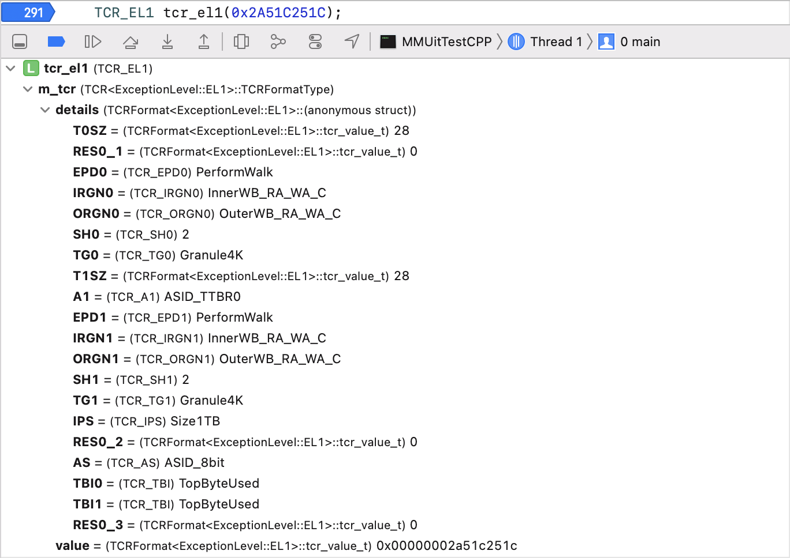
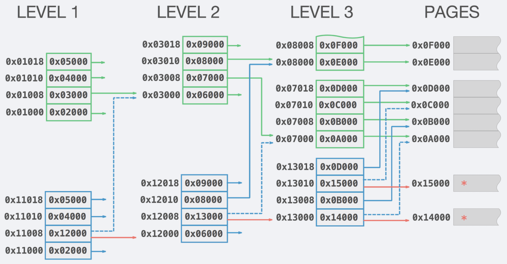

## Overview
**MMUit** is a lightweight toolkit to explore and modify address translation for ARM64.

- C/C++ interface
- detailed information on **VA**, **TTE**, **TCR** etc
- translation table walk (forward and reverse)
- page relocation (Yalu jailbreak style)

**NOTE:** it was mostly tested on iOS, not all translation modes are implemented.

## Usage

#### Exploring MMU

To get detailed information on particular items you can just feed objects with raw value and observe output in debugger.



Alternatively you can access particular fields and print them to console:

```cpp
TTLevel3Entry_16K entry(0x0000000000580003);
printf("PTE (L3, 16K): %.16llX\n", entry.getDescriptor());
printf("  valid:   %s\n", entry.isValid()? "YES" : "NO");
printf("  table:   %s\n", entry.isTableDescriptor()? "YES" : "NO");
printf("  page:    %s\n", entry.isPageDescriptor()? "YES" : "NO");
printf("  PXN:     %s\n", entry.getPXN()? "YES" : "NO");
printf("  XN:      %s\n", entry.getXN()? "YES" : "NO");
printf("  address: 0x%llX\n", entry.getOutputAddress());
```
Output:

```
PTE (L3, 16K): 0000000000580003
  valid:   YES
  table:   NO
  page:    YES
  PXN:     NO
  XN:      NO
  address: 0x580000
```

It is also possible to debug translation by manually walking through the dumped tables:

```cpp
TCR_EL1 tcr_el1(0x1651BA51B);
virt_addr_t TTBR0_EL1 = 0x100024000; // PA of the translation table dump
virt_addr_t va = 0x100005800;        // target VA

MMUConfig mmuConfig;
MMUConfigParser mmuConfigParser;
mmuConfigParser.setTCR_EL1(tcr_el1);
mmuConfig = mmuConfigParser.getConfigFor(ExceptionLevel::EL0);

virt_addr_t pageMask = uint32_t(mmuConfig.granule) - 1;
VA16K addr(va, mmuConfig.regionSizeOffset);
    
virt_addr_t tte_l1_pa = TTBR0_EL1 + addr.getOffsetForLevel(1);
// tte_l1_pa<0x100024000> : 0x100028003 (L1 TTE from the dump)
TTLevel1Entry_16K tte_l1(0x100028003);
    
virt_addr_t tte_l2_pa = tte_l1.getOutputAddress() + addr.getOffsetForLevel(2);
// tte_l2_pa<0x100028400>: 0x10002C003 (L2 TTE from the dump)
TTLevel2Entry_16K tte_l2(0x10002C003);
    
uint64_t tte_l3_pa = tte_l2.getOutputAddress() + addr.getOffsetForLevel(3);
// tte_l3_pa<0x10002C008>: 0x48000100004E03 (L3 TTE from the dump)
TTLevel3Entry_16K tte_l3(0x48000100004E03);
    
virt_addr_t pa = tte_l3.getOutputAddress() | (addr.rawValue() & pageMask);
```

#### Primitives

To work on real system it is required to implement your own `Primitives` class (or callback functions for C interface). It is used by **MMUit** to read/write kernel memory, PA→VA conversion, allocations etc. 

For example, FriedApple jailbreak used **copyin**/**copyout** primitives to deal with kernel memory and **gPhysBase**/**gVirtBase** to convert physical address:

```c
static uintptr_t read_address(virt_addr_t address) {
	uint64_t val = 0;
	copyin(&val, addr, 8);
	return val;
};
    
static void write_address(virt_addr_t address, virt_addr_t data) {
	copyout(addr, &data, 8);
}

static virt_addr_t physical_to_virtual (phys_addr_t address) {
	return address - gPhysBase + gVirtBase;
}

static virt_addr_t virtual_to_physical (phys_addr_t address) {
	ttwalker walker = {0};
	walker.granule = kTTGranule16K;
	walker.start_level = kTTLevel1;
	walker.table_base = physalloc(0x4000);
	walker.read_address = read_address;
	walker.physical_to_virtual = physical_to_virtual;
	return ttwalker_FindPhysicalAddress(&walker, address);
}
```
#### MMUConfig

Contains information about current MMU configuration and should be passed to **Walker** or **PageRelocator**.

```cpp
TCR_EL1 tcr_el1(0x2A51C251C);

MMUConfig mmuConfig;
MMUConfigParser mmuConfigParser;
mmuConfigParser.setTCR_EL1(tcr_el1);
	
mmuConfig = mmuConfigParser.getConfigFor(ExceptionLevel::EL1);
TTWalker<MyPrimitives> walker(mmuConfig, TTBR_VA);
PageRelocator<MyPrimitives> relocator(mmuConfig, TTBR_VA);
```

#### Walker

Allows to find **PA** (physical address) for particular **VA** (virtual address) moving through translation tables and executing callback function for every level to help debugging translation path. **Forward walk** is calling callbacks from **L0** to **L3** while **reverse walk** is calling callbacks from **L3** to **L0**.

```cpp
WalkResult walkResult = genericWalker->walkTo(TARGET_VA, 
[] (WalkPosition* position, TTGenericEntry* entry) -> WalkOperation {
	printf(" Level%d: %c%c%c [%.2lu][%.2lu]\n", position->level,
	   (entry->isValid())? 'v' : '-',
	   (entry->isTableDescriptor())? 't' : '-',
	   (entry->isPageDescriptor())? 'p' : '-',
	   GetLevelIndex(position->tableAddress), GetEntryIndex(position->entryOffset));
	return WalkOperation::Continue;
});
```

#### PageRelocator 

Provides functions to duplicate existing pages by relocating them using alternative translation path. Relocator also supports callbacks which can be used to modify TTE flags or data for duplicated page on a fly during relocation.  
Another option is to stage relocation process using `preparePageRelocationFor` (`pagerelocator_PreparePageRelocation` in C) function which returns VA of duplicated page to be modified separately. Then it is possible to call `cancelRelocation` to restore original translation path or `completeRelocation` to apply final modification to page TTE.

```cpp
virt_addr_t newPageVA = relocator.preparePageRelocationFor(TARGET_VA, 
[&relocator] (TTLevel level, TTGenericEntry* oldEntry, TTGenericEntry* newEntry) -> ttentry_t {
	printf("    MOVE: 0x%.16llX -> 0x%.16llX | [%.2lu][] -> [%.2lu][]\n",
	   oldEntry->getOutputAddress(),
	   newEntry->getOutputAddress(),
	   GetLevelIndex(oldEntry->getOutputAddress()), GetLevelIndex(newEntry->getOutputAddress()));
	return newEntry->getDescriptor();
});

uint64_t data = 0xDEADBEEFDEADBEEF;
copyout(newPageVA, &data, 8);

relocator.completeRelocation();
```

Page relocation is a known trick to patch kernel (Yalu jailbreak) which is described in details during **Fried Apples: Jailbreak DIY** keynote at BlackHat Asia 2017. In short it looks like that:



## Examples

### C++

`MMUIitTestCPP/main.cpp` contains demonstration and tests of main MMUit functionality using manually crafted translation table:  

1. finds page PA from VA and reads data at this address
2. uses forward walk to translate to VA logging TTE along the way
3. uses reverse walk to translete to VA logging TTE along the way
4. duplicates page for VA logging TTE and changing its XN/PXN flags and data on a fly during relocation
5. prepares duplicate page for VA logging TTE and returns address of that page
6. patches data for duplicated page
7. completes relocation (or cancels if `cancel = true`)
8. restores original translation path for (4)

### C

`MMUIitTestC/main.c` is functionally identical to C++ example above.
